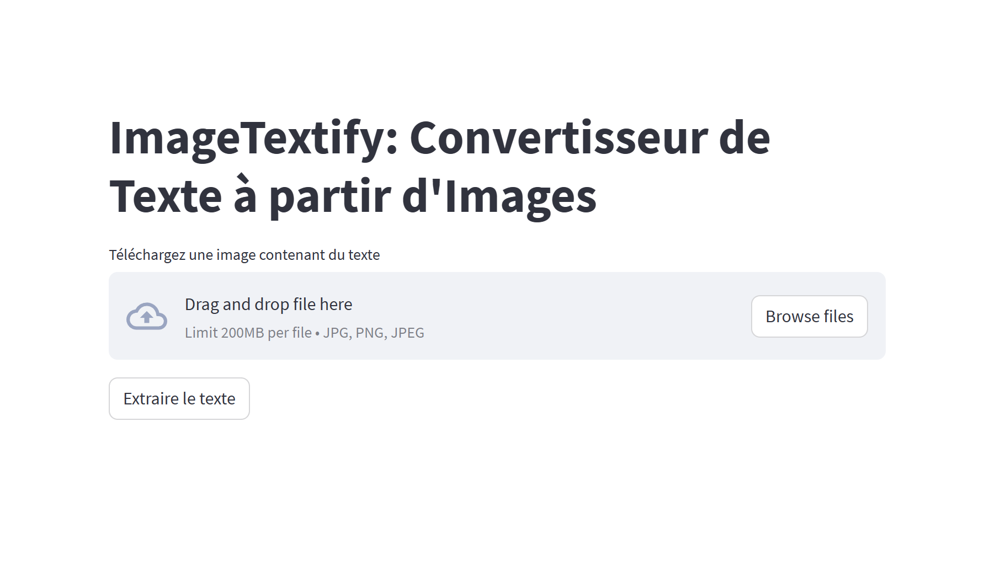

# ImageTextify

ImageTextify est une application Streamlit qui permet d'extraire un texte à partir d'une image en utilisant la
bibliothèque Tesseract OCR.

## Prérequis

Avant d'exécuter l'application, assurez-vous d'avoir installé les éléments suivants :

- Python 3.x
- Tesseract OCR
- Les bibliothèques Python listéess dans le fichier `requirements.txt`

## Installation

1. Clonez ce dépôt sur votre machine locale :

```bash
git clone https://github.com/rayanhcm2/ImageTextify
```

2. Accédez au répertoire du projet :

```bash
cd ImageTextify
```

3. Installez les dépendances en exécutant la commande suivante :

```bash
pip install -r requirements.txt
```

4. Exécutez l'application ImageTextify en utilisant la commande suivante :

```bash
streamlit run main.py
```



## Auteur

[HACHEMI Rayan]